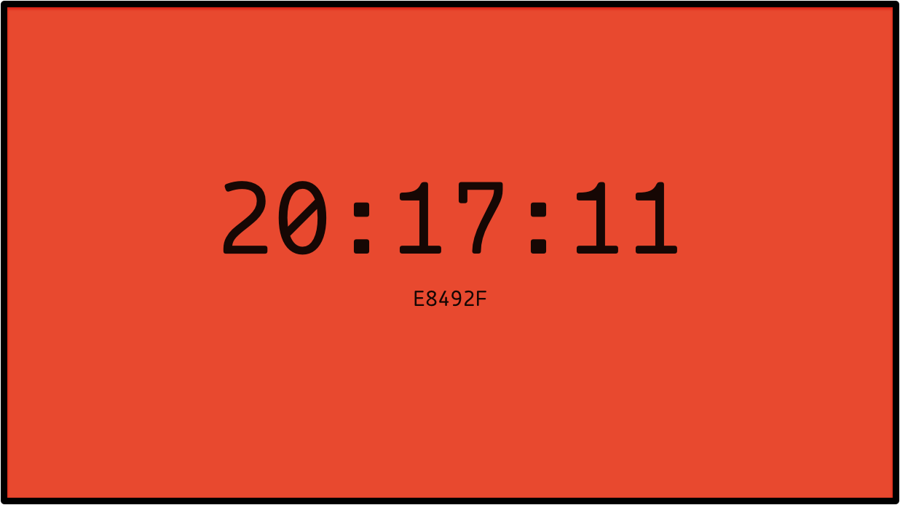

# A ScreenSaver for macOS

[Announcement blog post](https://blog.edwardloveall.com/colorclocksaver)

## Installation

_Note: This screensaver requires macOS Sierra (10.12)_

Download the latest [release](https://github.com/edwardloveall/ColorClockSaver/releases/latest) and place it in your `~/Library/Screen Savers/` directory. Then, open System Preferences > Desktop & Screen Saver and select ColorClockSaver from the list.
