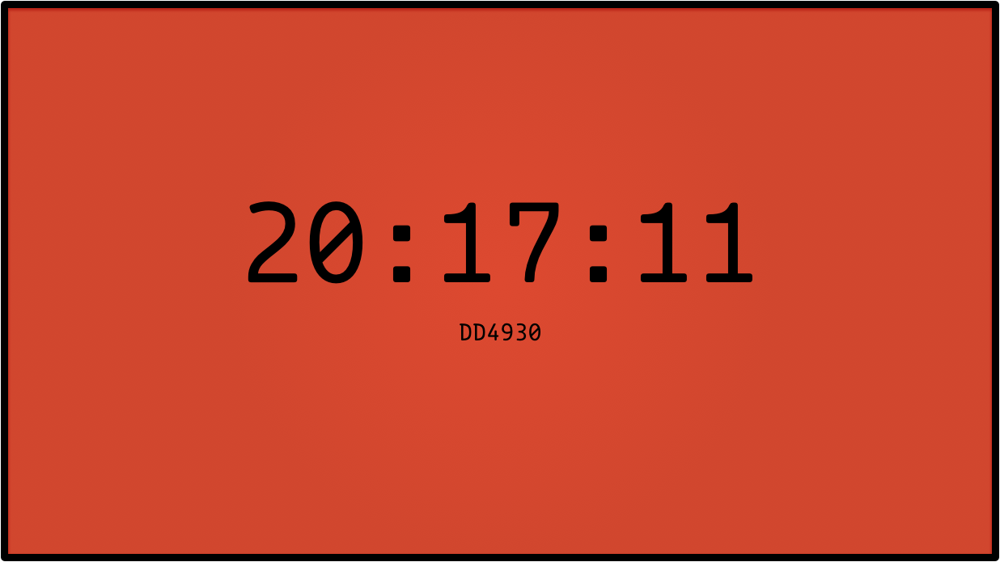

ColorClock is a screen saver for Mac OS X created in QuartzComposer and Xcode. It was inspired by [The Colour Clock ](http://www.clock.lookatjack.com/) by [Jack Hughes](http://www.lookatjack.com/)

## Installation

To install the screen saver, place `ColorClock.saver` inside the `~/Library/Screen Savers` folder. You may have to resort to [trickery and black magic](http://www.macworld.com/article/1161156/view_library_folder_in_lion.html) to get inside your Library folder. You also may have to create the `Screen Savers` folder.

If you have any questions, feel free to contact me on [App.net](https://alpha.app.net/edwardloveall)